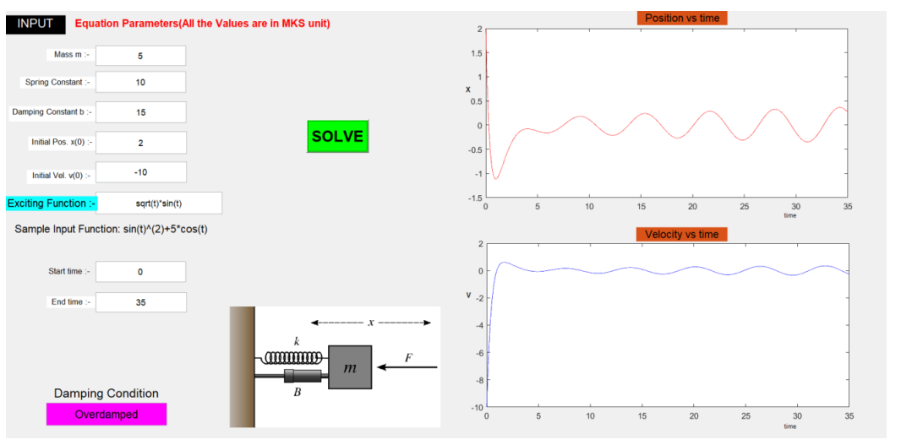

---

# Spring-Mass System Simulation

This project simulates the dynamics of a spring-mass system using numerical methods. It allows users to plot the position and velocity of a mass attached to a spring over time based on given parameters such as damping constant, spring constant, mass, and external force.

## Project Overview

The spring-mass system is modeled by the following second-order differential equation:

$$
m \frac{d^2x}{dt^2} + b \frac{dx}{dt} + kx = F(t)
$$


Where:
- \( m \) is the mass attached to the spring.
- \( b \) is the damping constant.
- \( k \) is the spring constant.
- \( F(t) \) is the external force applied to the system as a function of time.
- \( x(t) \) is the displacement of the mass from its equilibrium position.


## User Interface

The project includes a graphical user interface (GUI) that allows users to input the parameters for the spring-mass system. The interface accepts inputs for:

- **Mass (m)**: The mass of the object in kilograms.
- **Damping Constant (b)**: The damping constant in `kg/s`.
- **Spring Constant (k)**: The spring constant in `N/m`.
- **Initial Position (u0)**: The initial displacement of the mass.
- **Initial Velocity (v0)**: The initial velocity of the mass.
- **Excitation Function (F(t))**: The external force applied to the system, which can be entered as a function of time.
- **Damping Condition**: A checkbox to enable or disable damping.

### Output

Once the parameters are set, clicking on the `SOLVE` button will compute and plot:

- **Position (x) vs. Time**: Displays the time evolution of the position of the mass.
- **Velocity (dx/dt) vs. Time**: Displays the time evolution of the velocity of the mass.

The output graphs provide a visual representation of the system's response to the given inputs, allowing users to observe how changes in parameters affect the motion.


## User Interface

The project includes a graphical user interface (GUI) that allows users to input the parameters for the spring-mass system. The interface accepts inputs for:

- **Mass (m)**: The mass of the object in kilograms.
- **Damping Constant (b)**: The damping constant in \( kg/s \).
- **Spring Constant (k)**: The spring constant in \( N/m \).
- **Initial Position (u0)**: The initial displacement of the mass.
- **Initial Velocity (v0)**: The initial velocity of the mass.
- **Excitation Function (F(t))**: The external force applied to the system, which can be entered as a function of time.
- **Damping Condition**: A checkbox to enable or disable damping.

### Output

Once the parameters are set, clicking on the `SOLVE` button will compute and plot:

- **Position (x) vs. Time**: Displays the time evolution of the position of the mass.
- **Velocity ((dx/dt)) vs. Time**: Displays the time evolution of the velocity of the mass.

The output graphs provide a visual representation of the system's response to the given inputs, allowing users to observe how changes in parameters affect the motion.


## Example Inputs

Here are sample values to test the system:

- **Mass (m)**: 5 kg
- **Damping Constant (b)**: 0.5 kg/s
- **Spring Constant (k)**: 100 N/m
- **Initial Position (u0)**: 1 m
- **Initial Velocity (v0)**: 0 m/s
- **Excitation Function (F(t))**: \( 50 \sin(2\pi t) \)

## User Interface

The GUI for this project allows users to input parameters and solve the system. The interface is intuitive, with options for mass, damping, spring constants, initial conditions, and external force functions. Upon clicking the `SOLVE` button, the results are displayed as graphs for position and velocity over time.

Here is a snapshot of the GUI:

  <!-- Adjust the path according to where you store the image -->


## Installation

1. Clone the repository:
   ```
   git clone https://github.com/your-username/spring-mass-simulation.git
   ```
2. Navigate to the project directory:
   ```
   cd spring-mass-simulation
   ```
3. Open the GUI file in MATLAB or your preferred environment that supports the graphical interface.

## Usage

1. Input the system parameters in the provided text fields.
2. Define the external force function \( F(t) \).
3. Click on `SOLVE` to view the simulation results for position and velocity over time.


## License

This project is licensed under the MIT License.

---

Feel free to modify any sections to better fit your project specifics. Let me know if you'd like further customizations!
